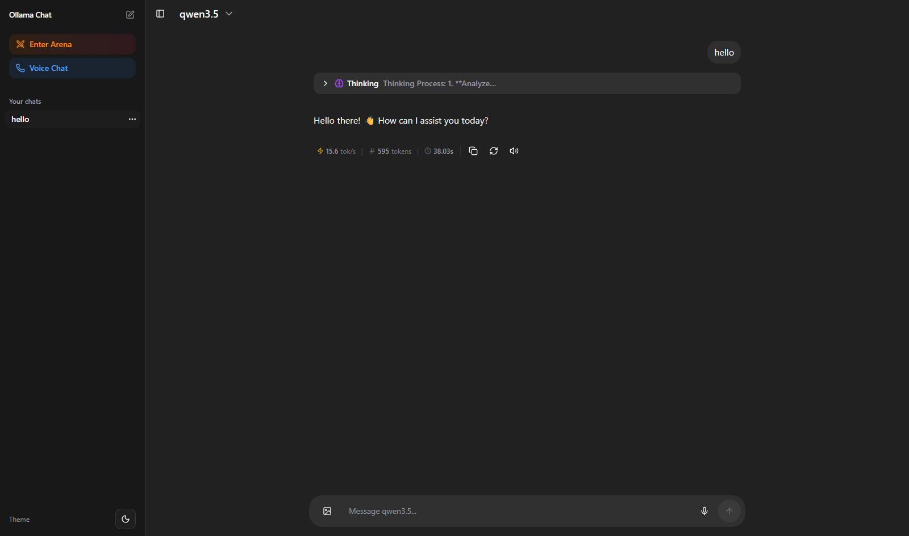
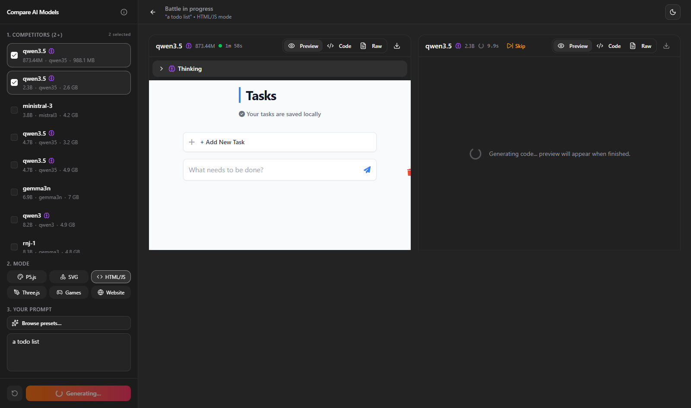
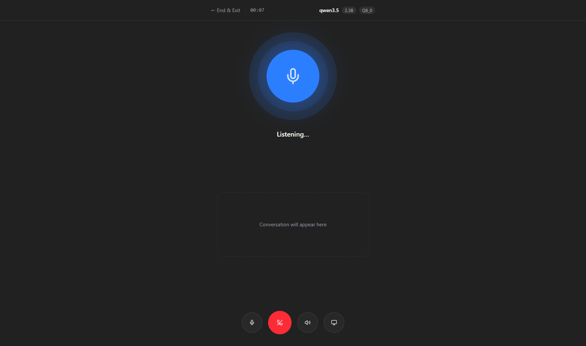

# next-ollama-chat

A local AI chat application powered by [Ollama](https://ollama.com), built with Next.js 16, the Vercel AI SDK, SQLite, Drizzle ORM, and shadcn/ui.

> **Requires Ollama running locally.** Pull any model with `ollama pull <model>` before starting.

| Chat              | Arena               | Voice               |
| ----------------- | ------------------- | ------------------- |
|  |  |  |

## Features

- Chat: multi-turn conversations with markdown and syntax-highlighted code rendering, image attachments for vision models, persistent chat history, and per-chat model selection
- Arena: send the same prompt to two models side-by-side and compare responses in real time
- Voice: hands-free voice call interface with low-latency TTS streaming
- Screen share: capture the active screen when speaking to vision-capable models in voice mode
- Dark mode: system preference detection via `next-themes`
- Model capability detection: vision and thinking support are auto-detected per Ollama model
- SQLite persistence: chat history and the selected model are stored in `data/app.db` through Drizzle ORM

## Prerequisites

- [Ollama](https://ollama.com) installed and running (`ollama serve`)
- At least one model pulled, e.g. `ollama pull qwen3.5` or `ollama run qwen3.5`
- Node.js 20+ installed

## Quick Start

```bash
git clone https://github.com/aleksa-codes/next-ollama-chat
cd next-ollama-chat
bun install
bun run dev
```

Open [http://localhost:3000](http://localhost:3000).

The SQLite database is created automatically at `data/app.db` on first run.

## Database migrations

If you change the schema (add/remove fields or tables), generate and apply a new Drizzle migration:

```bash
bun run db:generate
bun run db:migrate
```

> Note: The server runs `bun run db:migrate` automatically on startup, so you typically only need to run it manually when working on migrations.

## Scripts

| Command               | Description                        |
| --------------------- | ---------------------------------- |
| `bun run dev`         | Start development server           |
| `bun run build`       | Build for production               |
| `bun run start`       | Run production server              |
| `bun run lint`        | Lint with ESLint                   |
| `bun run format`      | Format with Prettier               |
| `bun run shadcn`      | Add shadcn/ui components           |
| `bun run deps`        | Update dependencies interactively  |
| `bun run db:generate` | Generate Drizzle SQL migrations    |
| `bun run db:migrate`  | Apply generated Drizzle migrations |
| `bun run db:studio`   | Open Drizzle Studio                |

## Tech Stack

- [Next.js 16](https://nextjs.org): App Router
- [Vercel AI SDK](https://sdk.vercel.ai): streaming chat with `useChat`
- [ai-sdk-ollama](https://github.com/jagreehal/ai-sdk-ollama): Ollama provider and streaming helpers
- [SQLite](https://www.sqlite.org/index.html) + [Drizzle ORM](https://orm.drizzle.team): local persistence for chats and preferences
- [Tailwind CSS v4](https://tailwindcss.com): utility-first styling
- [shadcn/ui](https://ui.shadcn.com): component library
- [React 19](https://react.dev) with React Compiler
- [marked](https://marked.js.org) + [shiki](https://shiki.style): markdown and code rendering
- [Web Speech API](https://developer.mozilla.org/en-US/docs/Web/API/Web_Speech_API): STT and TTS for voice mode

## License

MIT, see [LICENSE](LICENSE) for details.
